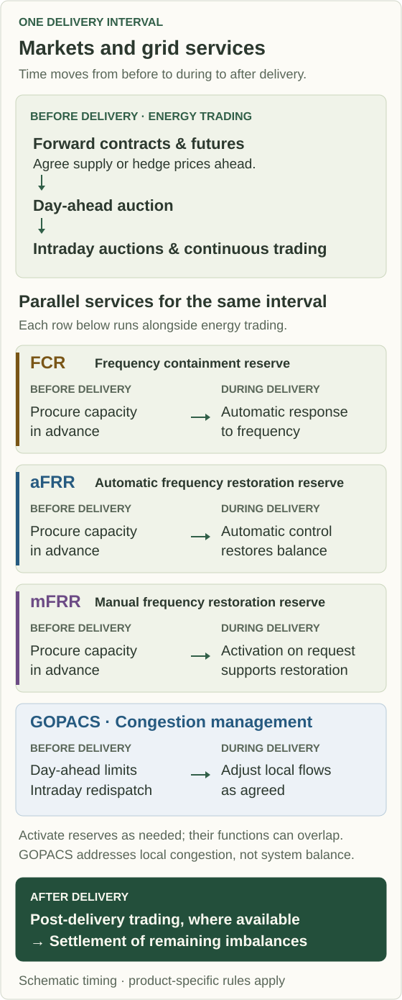
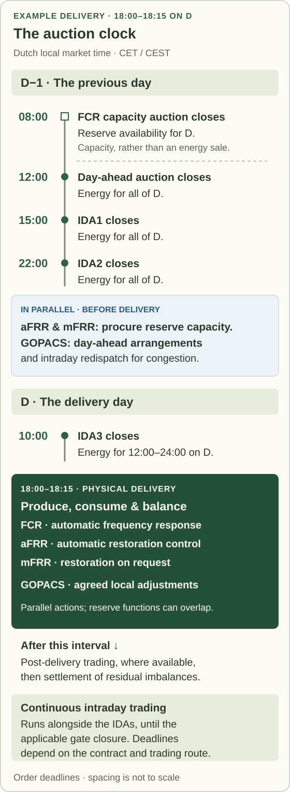

Follow **one delivery interval** to understand the Dutch electricity markets: a contract agreed months ago and a trade made this afternoon can concern the same quarter-hour tonight.

**D** is the delivery day; **D−1** is the preceding day. Auction times use Dutch local market time (CET/CEST). Sources checked on **10 October 2026**.

## In what order do the markets operate?

*Figure 1. Trading and parallel grid services for one delivery interval. Reserve procurement precedes activation; GOPACS arrangements address local congestion.*

The markets overlap across delivery periods: while today's electricity is being delivered, participants can trade for later today, bid for tomorrow, and hedge next year.

## What happens months or years before delivery?

Generators, suppliers, and large consumers use **bilateral contracts**, negotiated between counterparties, or standardized **exchange-traded futures** to agree future transactions and manage price exposure. Long-term power purchase agreements (**PPAs**) are a form of bilateral contracting. [ACER: forward markets and PPAs](https://www.acer.europa.eu/monitoring/MMR/electricity-market-integration-2025)

EEX offers Dutch power futures with month, quarter, and year maturities, cash settlement, and a physical fulfilment option. **A cash-settled hedge does not schedule physical delivery**: a supplier may hedge months ahead and still buy its physical energy in the spot market. [EEX: Dutch power futures](https://www.eex.com/en/markets/power/power-futures)

## What happens in the day-ahead market?

The **day-ahead auction** trades electricity for the following day, normally closing at **12:00 on D−1**. EPEX SPOT and Nord Pool provide access to European **Single Day-Ahead Coupling (SDAC)**, which matches orders across bidding zones subject to cross-border transmission constraints. [Nord Pool: auction process](https://www.nordpoolgroup.com/en/the-power-market/Day-ahead-market/), [ENTSO-E: SDAC](https://www.entsoe.eu/network_codes/cacm/implementation/sdac/)

Since **1 October 2025**, the coupled market uses **15-minute delivery intervals**: 96 clearing prices for an ordinary 24-hour day, all established ahead of delivery. [SDAC: 15-minute transition](https://www.omel.es/sites/default/files/2025-10/successful-implementation-of-15-minute-market-time-unit-mtu-in-sdac_0.pdf)

## How do intraday auctions and continuous trading fit together?

**Intraday trading** adjusts positions as forecasts, demand, and plant availability change. Continuous trading matches compatible orders as they arrive, so trades for the same delivery interval can have different prices. [Nord Pool: intraday trading](https://www.nordpoolgroup.com/en/the-power-market/Intraday-market/)

The Netherlands also participates in three coupled **intraday auctions (IDAs)**:

| Auction | Order deadline | Delivery periods covered |
| --- | --- | --- |
| **IDA1** | **15:00 on D−1** | All of D |
| **IDA2** | **22:00 on D−1** | All of D |
| **IDA3** | **10:00 on D** | 12:00–24:00 on D |

*Figure 2. Order deadlines for an example 18:00–18:15 delivery. FCR procures capacity; the other auctions trade energy. The parallel aFRR, mFRR, and GOPACS arrangements have product-specific timing, not a shared deadline between IDA2 and IDA3.*

These quarter-hour auctions have **two deadlines on the previous day**. The times shown are order deadlines, not guaranteed result-publication times. [Nord Pool: IDA timings and coverage](https://support.nordpoolgroup.com/support/solutions/articles/8000111575-about-the-sidc-intraday-auctions-idas-), [EPEX SPOT: timetable in CET/CEST](https://www.epexspot.com/sites/default/files/2024-07/Trading%20brochure%20July%202024.pdf)

Continuous trading runs alongside the auctions until the applicable **gate closure**, or trading deadline. That deadline depends on the product, market, and trading route, including whether it crosses a border. [Nord Pool: intraday operation](https://www.nordpoolgroup.com/en/the-power-market/Intraday-market/)

## When are balancing reserves bought and used?

TenneT, the Dutch transmission system operator, uses reserves to maintain balance during delivery:

| Reserve | Full name | Function during operation |
| --- | --- | --- |
| **FCR** | Frequency Containment Reserve | Responds automatically to frequency deviations to contain them. |
| **aFRR** | Automatic Frequency Restoration Reserve | Follows automatic control signals to restore balance. |
| **mFRR** | Manual Frequency Restoration Reserve | Is activated on request to support restoration of balance and relieve other reserves. |

These control functions can overlap. [TenneT: balancing processes, Chapter 8](https://netztransparenz.tennet.eu/fileadmin/user_upload/Company/Publications/Technical_Publications/Dutch/2017_TenneT_Market_Review.pdf)

**Capacity procurement** secures availability beforehand; **activation** changes power during operation. For aFRR, the capacity commitment and delivered balancing energy are distinct parts of the service. [TenneT: aFRR manual](https://tennet-drupal.s3.eu-central-1.amazonaws.com/default/2023-08/aFRR%20manual%20for%20BSPs%20en.pdf)

For example, the common FCR capacity auction, which includes the Netherlands, closes at **08:00 on D−1—before the day-ahead energy auction**—for availability during D. [ENTSO-E: FCR procurement](https://www.entsoe.eu/network_codes/eb/fcr/)

A **balancing service provider (BSP)** qualifies to deliver reserves; a **balance responsible party (BRP)** is financially responsible for its portfolio's imbalances. One company can perform both roles. [ENTSO-E: BSP and BRP requirements, Dutch entry](https://www.entsoe.eu/network_codes/eb/requirements-for-bsps-and-brps-across-europe/)

## What happens after delivery?

Nord Pool's Dutch **post-delivery market** lets BRPs adjust nominated positions after delivery. Its guide states a deadline of **09:30 CET the following day**; check the applicable operating timetable. These trades change commercial positions, not past physical flows. [Nord Pool: post-delivery guide, updated 22 September 2026](https://support.nordpoolgroup.com/support/solutions/articles/8000130777-post-delivery-market)

**Imbalance settlement** accounts for each BRP's residual deviations from its commercial position over **15-minute settlement periods**. Physical balancing operates continuously within those periods. [TenneT: balance responsibility, Chapter 8](https://netztransparenz.tennet.eu/fileadmin/user_upload/Company/Publications/Technical_Publications/Dutch/2017_TenneT_Market_Review.pdf)

Providing a reserve service as a BSP differs from operating assets in response to expected imbalance prices as a BRP. The latter is often called the **“imbalance market”**, but an imbalance price settles deviations; it is not an executable exchange quote. [ENTSO-E: balancing roles](https://www.entsoe.eu/network_codes/eb/requirements-for-bsps-and-brps-across-europe/), [TenneT: imbalance pricing](https://netztransparenz.tennet.eu/fileadmin/user_upload/SO_NL/Imbalance_pricing_system.pdf)

## Can you follow one delivery interval through the sequence?

Consider an **invented wind-farm example** for **18:00–18:15 on D**, with no earlier physical supply contract, reserve activation, or post-delivery trade:

1. **Months ahead:** the owner may hedge financially, without adding a physical sale.
2. **Day-ahead:** it sells **10 MWh** for that quarter-hour, equivalent to an average output of 40 MW.
3. **Intraday:** expected output falls to **8 MWh**. It buys back **2 MWh**, leaving a net sale of **8 MWh**.
4. **During delivery:** it produces **7.5 MWh**. TenneT balances the aggregate system, rather than each farm individually.
5. **After delivery:** the farm contributes a **0.5 MWh shortfall** to its BRP's portfolio. Other positions may offset this before the residual imbalance is settled.

The arithmetic is **10 − 2 − 7.5 = 0.5 MWh**: intraday trading adjusts the commitment; settlement accounts for the remaining difference.

## Where do congestion management and household contracts fit?

**Congestion management** addresses local line or transformer limits, which can be exceeded even when total production and consumption balance. **GOPACS** coordinates day-ahead capacity restrictions and intraday redispatch through connected trading platforms. It runs alongside the trading sequence and is not itself an electricity exchange. [GOPACS: operation and timing](https://www.gopacs.eu/en/how-does-gopacs-work/)

**Retail supply** connects these markets to households through fixed, variable, or dynamic tariffs. A dynamic tariff may follow day-ahead prices while the supplier and its trading partners manage later adjustments. [ACM: electricity tariffs](https://consument.acm.nl/elektriciteit-en-gas/wat-betaal-ik-voor-mijn-energie/vaste-variabele-leveringskosten-energie)

For practical examples, see [how a household can participate in the Dutch electricity market](../participate-electricity-market-netherlands/) and [how Tibber smart charging connects to these markets](../tibber-ev-smart-charging-markets/).
